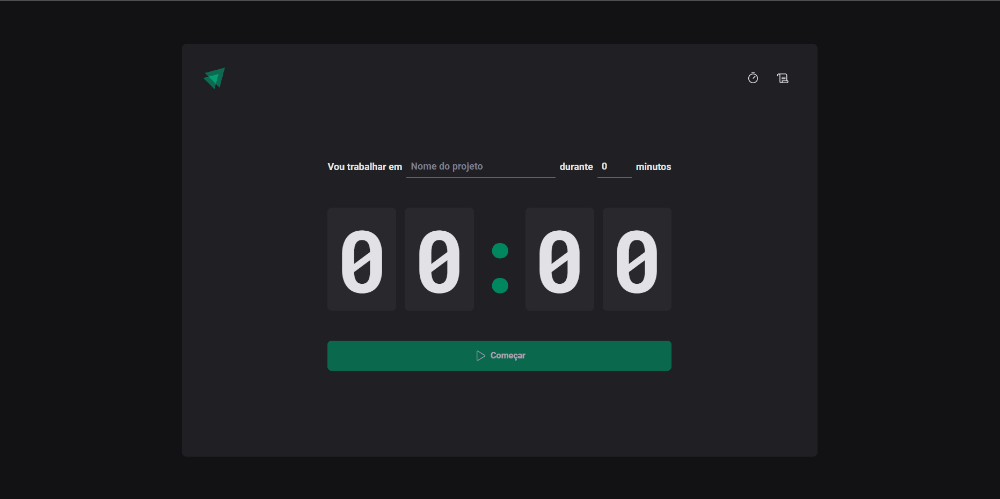

    

<h1 align="center" >Ignite Timer</h1 >

<h2 style="" >Tabela de Conteúdo - Table of Contents</h2>

<ul>
   <li><a href="#tabela">Tabela de Conteúdo - Table of Contents</a></li>
   <li><a href="#sobre">Sobre - About</a></li>
   <li><a href="#demonstração">Demonstração - Demonstration</a></li>
   <li><a href="#tecnologias">Tecnologias - Technologies</a></li>
   <li><a href="#requisitos">Requisitos - Requirements</a></li>
   <li><a href="#licença">Licença - License</a></li>
   <li><a href="#autor">Autor - Author</a></li>
   <li><a href="#contato">Contato - Contact</a></li>
</ul>

 

# Sobre / About

Project was developed during the ignite course given by <a target="_blank" href="https://www.rocketseat.com.br/">Rocketseat💜</a>, it is about of a timer where we add a task and determine a deadline to finish it, very similar to the pomodoro technique.   The application adds time in multiples of 5 (minutes) with the maximum allowed of 60 minutes for any task, it is possible to view history and use it even in the background.

-------------------------------------------------------------------------------------------------

Projeto foi desenvolvido durante o curso ignite ministrado pela <a target="_blank" href="https://www.rocketseat.com.br/">Rocketseat💜</a>, se trata de um timer onde adicionamos uma tarefa e determinamos um prazo para finalizar bem semelhante a técnica de pomodoro.   A aplicação adiciona tempo em múltiplos de 5(minutos) com o máximo permitido de 60 minutos para alguma tarefa, nela é possível visualizar históricos e utilizar mesmo em segundo plano.

 <a target="_blank" href="https://montanari-timer.onrender.com/">Click Aqui para acessar a alicação</a> 

# Demonstração / Demonstration

Desktop

 

 

# Tecnologias / Technologies

<ul>
   <li>
    <a target="_blank" href="https://create-react-app.dev/">React Create App</a>
     
   </li>

   <li>
    <a target="_blank" href="https://reactrouter.com/en/main/start/overview">React Router Dom</a>
    </li>
   <li>
        <a  target="_blank"href="https://www.typescriptlang.org/">TypeScript</a>
        
   </li>
   <li>
    <a target="_blank" href="https://www.npmjs.com/">Npm</a>
    </li>

<li>
    <a target="_blank" href="https://styled-components.com/">Styled Components</a>
    </li>

<li>
    <a target="_blank" href="https://reactjs.org/docs/context.html">Context Api</a>
    </li>
    
<li>
    <a target="_blank" href="https://reactjs.org/docs/hooks-reference.html#usereducer">Reduce</a>
    </li>

    
</ul>

 

# Requisitos / Requirements

<ul>
   <li>Have Node.js LTS version installed</li>
   <li>Have NPM installed (usually comes bundled with node.js)</li>
   <li>Follow the steps below</li>
-----------------------------------------------------------------
   <li>Possuir Node.js versão LTS instalada</li>
   <li>Possuir NPM instalado (normalmente vem junto ao node.js)</li>
   <li>Seguir os passos abaixo</li>
   
  

      #No terminal do seu sistema - In your system terminal
      #clone este repositório - clone this repository
      $ git clone <https://github.com/montanari2019/ignite-timer>

      # Acesse a pasta do projeto no terminal/cmd  - Access project folder in terminal/cmd
      $ cd ignite-timer

      
      # Instale as dependências com o comando - Install the dependencies with the command
      $ npm install

       # Execute a aplicação em modo de desenvolvimento - Run the application in development mode
      $ npm run dev

      # Servidor ira executar na porta:cesse <http://localhost:3000/>
      # Server will run on port:3000 - go to <http://localhost:3000/>

</ul>

# Licença / License

Distribuído sob a licença MIT. Veja <code>LICENSE</code> para mais informações.

-------------------------------------

Distributed under the MIT license. See <code>LICENSE</code> for more information.

# Autor / Author

    

Ikaro Montanari, tech enthusiast and front-end developer

Graduated in Systems Analysis and Development by IFRO in Vilhena-RO

Front-end Web Developer at Mirian Posts, in the fuel sector

---------------------------------------------

Ikaro Montanari, entusiasta por tecnologia e desenvolvedor front-end

Formado em Análie e Desenvolvimento de Sistemas pelo IFRO em Vilhena-RO

Desenvolvedor Web Front-end nos Postos Mirian

# Contato / Contact

Linkedin <a target="_blank" href="https://www.linkedin.com/in/ikaro-montanari-5aa120208/">Ikaro Montanari</a> 

Instagram  <a target="_blank" href="https://www.instagram.com/ikaro.montanari/">@ikaro_montanari</a> 

Telefone <a target="_blank" href="https://api.whatsapp.com/send?phone=5569993569547&text=Ol%C3%A1%20ikaro">(69) 99356-9547</a> 

